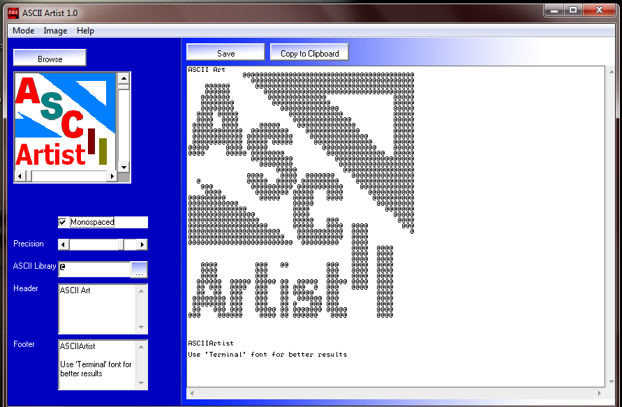
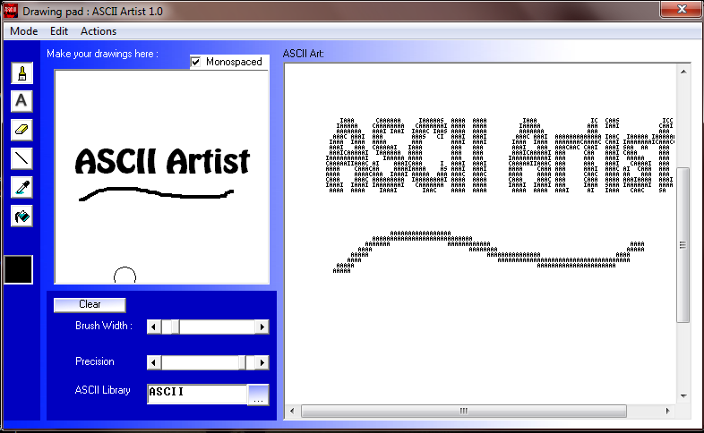

AsciiArtist
===========

Image/Drawing to ASCII Art...

One of my old VB6 experiments...

```
                                                
    &&&       &&&&&&&    &&&&&&& &&&&&& &&&&&   
   &&&&&     &&&& &&&   &&&&&&&&  &&&&  &&&&    
   &&&&&     &&&&   &  &&&    &&& &&&&   &&&    
   &&&&&&    &&&&&&    &&&    &&  &&&&   &&&    
   &  &&&    &&&&&&&& &&&&        &&&&   &&&    
  &&  &&&&    &&&&&&& &&&&        &&&&   &&&    
  &&&&&&&&  &&  &&&&&& &&&&       &&&&   &&&    
 &&&&&&&&&& &&    &&&  &&&&&  &&  &&&&   &&&    
&&&    &&&&  &&&&&&&&   &&&&&&&&  &&&&& &&&&&   
&&&&  &&&&&&  &&&&&&     &&&&&   &&&&&& &&&&&   

     &&                                         
     &&&                 &   &&&&            &  
    &&&&&               &&    &&            &&  
    &&&&&          &  &&&&&&    &   &&&&  &&&&&&
    & &&&&   &&&&&&&& &&&&&& &&&&  &&&&&& &&&&&&
   &&  &&&    &&&&&&&  &&&    &&&  &&&  &  &&&  
   &&&&&&&&   &&&  &   &&&    &&&  &&&&&   &&&  
  &&&&&&&&&   &&&      &&&    &&&   &&&&&  &&&  
  &&    &&&&  &&&      &&&    &&&  &  &&&  &&&  
 &&&&  &&&&&&&&&&&&    &&&&& &&&&& &&&&&&  &&&&&
  &      &&    &&       &&&    &    &&&&    &&& 
                                                
                                                
```
### Screenshot - Conversion Mode


### Screenshot - Drawing Mode

